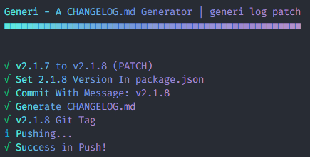

<h1 align="center">
Generi
</h1>

  

<h4 align="center">
A Versioning Generator for JavaScript Projects.
<h4>

  
  

 
 

- ✅ Easy CLI
- ✅ Monorepo support (with [Lerna](https://lerna.js.org/))

### Install

`npm i -g generi` or `yarn global add generi`

### Usage

#### `generi init`

Init `generi.json` configuration, and, if necessary, a git project
 

#### `generi log <patch|minor|major>`

Generate CHANGELOG.md and the necessary contents

`generi log patch` 0.1.0 >> 0.1.1

`generi log minor` 0.1.0 >> 0.2.0

`generi log major` 0.1.0 >> 1.0.0
 

#### `generi revert`

Revert `generi log` last command
 

### Monorepo

Monorepo versions may depend on external tools. Given this, Generi supports lerna workspaces, using the command `lerna version` before creating the changelog. In other setups, we recommend disabling the `tag` and `version` options.

### generi.json

##### `silent` Default: `false`

Do not emit any message in console

##### `commits` Default: `"none"`

Default format content in CHANGELOG.md

Options: `none` | [`conventional-commits`](https://www.conventionalcommits.org/en/v1.0.0/)

##### `tag` Default: `true`

Release a git tag

##### `version` Default: `true`

Insert new version in package.json

##### `push` Default: `false`

Push commits in actually branch after log

##### `publish` Default: `false`

Publish(NPM) package in final log
